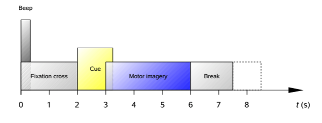
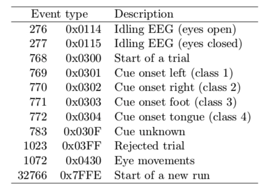
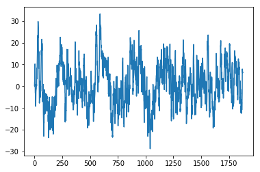

# BCI Competition Dataset IV 2a for python and numpy

This is a repository for BCI Competition 2008 dataset IV 2a fixed and optimized for python and numpy. This dataset is related with motor imagery. That is only a "port" of the original dataset, I used the original GDF files and extract the signals and events.

## How to use

You need to read the original paper [here](http://bbci.de/competition/iv/desc_2a.pdf). In that paper the authors explain the adquisition process. The dataset contain data about motor imagery of four different motor imagery tasks, namely the imagination of movement of the left hand (class 1),right hand (class 2), both feet (class 3), and tongue (class 4).

The form of each motor imagery task is like the figure below. (the figure was extracted for the original paper).

<p align="center">
    
</p>

Exist 9 subjects and for each subject one run that consists of 48 trials (12 for each of the four possible classes), yielding a total of 288 trials per session.

Each event (e.g. Start of Trial) is coded using the below table, this table was extraxted for the original paper.

<p align="center">
    
</p>

Please, for understand the complete work read the original paper [here](http://bbci.de/competition/iv/desc_2a.pdf).

### About this work

The current fileformat of these files are ".npz", for load this each file (e.g. A01T.npz) you can use numpy.load() command. Below you can see an example.

```python
import numpy as np
data = np.load('A01T.npz')
```

The names convention used for each datafile is the next:

-   's': contains all the raw data in a numpy array format.
-   'etyp': have all the events and its determinated type.
-   'epos': contains all the events position and its index is related with etyp and edur.
-   'edur': contains all the events duration.

I propose a simple example for understand more how to can to extract a trial.

```python
import numpy as np
data = np.load('A01T.npz') # data contains the data of the subject 1
signal = data['s']
channelC3 = signal[7] # The index 7 represent the channel C3, for the info of each channel read the original paper.

x = 7 # this is the event number that I want to extract

etype = data['etyp'].T[0, x] # Extract the type of the event 7 in this case the type is 768 (in the table this is a Start of a trial event).
epos = data['epos'].T[0, x] # This is the position of the event in the raw signal
edur = data['edur'].T[0, x] # And this is the duration of this event

trial = channelC3[epos:epos+edur] # Then I extract the signal related the event selected.

# The selected event type is 768 (Start of a trial) if you see the array of event types ('etype')
# you can observe the next event is 772 (Cue onset tongue) with that you can deduce de class of
# this trial: Tongue Imagery Task.

# Then for know the class of this trial (7) you need to read the type of the inmediate next event
trial_type =  data['etyp'].T[0, x+1]

# For know the order of this events, you can see the data['etyp'] array.

# You can plot this event with matplotlib
from matplotlib import pyplot as plt
plt.plot(trial)
plt.show()
```

The result of this code is the plot of the one trial.

<p align="center">
    
</p>

### One more complex example

In this example I've create a class with a method for extract all trials of one subject (AT01 in the example). Notate that try catch is here because some trial have a reject event, then with this try/catch I select only valid trials.

```python
class MotorImageryDataset:
    def __init__(self, dataset='A01T.npz'):
        if not dataset.endswith('.npz'):
            dataset += '.npz'

        self.data = np.load('A01T.npz')

        self.Fs = 250 # 250Hz from original paper

        # keys of data ['s', 'etyp', 'epos', 'edur', 'artifacts']

        self.raw = self.data['s'].T
        self.events_type = self.data['etyp'].T
        self.events_position = self.data['epos'].T
        self.events_duration = self.data['edur'].T
        self.artifacts = self.data['artifacts'].T

        # Types of motor imagery
        self.mi_types = {769: 'left', 770: 'right', 771: 'foot', 772: 'tongue', 783: 'unknown'}

    def get_trials_from_channel(self, channel=7):

        # Channel default is C3

        startrial_code = 768
        starttrial_events = self.events_type == startrial_code
        idxs = [i for i, x in enumerate(starttrial_events[0]) if x]

        trials = []
        classes = []
        for index in idxs:
            try:
                type_e = self.events_type[0, index+1]
                class_e = self.mi_types[type_e]
                classes.append(class_e)

                start = self.events_position[0, index]
                stop = start + self.events_duration[0, index]
                trial = self.raw[channel, start:stop]
                trials.append(trial)

            except:
                continue

        return trials, classes

datasetA1 = MotorImageryDataset()
trials, classes = datasetA1.get_trials_from_channel()
# trials contains the N valid trials, and clases its related class.
```

## Contribute

If you want contribute please add a issue and I'll work in that. Thank for all.

<p align="center">
    
</p>
